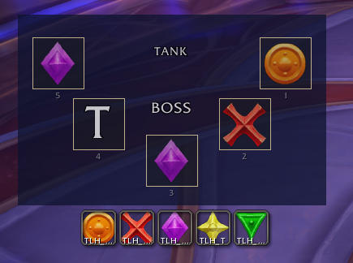
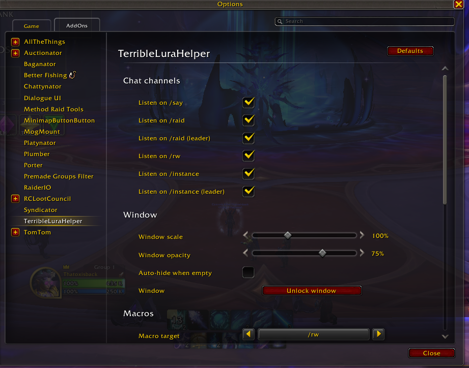
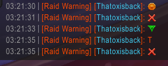

# TerribleLuraHelper

A standalone World of Warcraft Midnight addon that helps a raid
coordinate during the Midnight Falls boss fight against L'ura. This
addon lets one spotter press five pre-bound macros (created by the
addon) and surfaces the result, in human-readable form, both in raid
chat and in a dedicated helper window every player with the addon can
see.

## Basic Usage

After installing, run `/lura config` to open the
**TerribleLuraHelper** options. From there you can pick which chat
channels the helper window listens on, set its scale and opacity,
toggle auto-hide, and choose which channel the macros send to (`/raid`
is the default).

If you're gonna be your group spotter, the five rune macros —
`TLH_Diamond`, `TLH_Triangle`, `TLH_Circle`, `TLH_Cross`, `TLH_T` —
are created automatically on first login. Drag them from `/macro` onto
your action bar or assign keybinds. `TLH_T` uses the **Star**
raid-marker icon for action-bar recognizability, but the macro sends
the literal letter **T** to chat.

The helper window updates whenever **any** raid member presses one of
the macros — you don't need to be the spotter to see slots fill. Slots
populate in arrival order (1 through 5), and the display auto-clears
20 seconds after the last update so it's empty and ready for the next
L'ura cast.

Players without the addon aren't left out: the macros emit ordinary
raid-marker icons (and a literal `T`) into chat, so anyone who can
read the chat frame can still see the rune sequence and react. The
addon just gives those messages a dedicated, scaled-up display.

## Limitations

Because Blizzard's chat-messaging-lockdown blocks tainted addon
strings during boss fights, this addon can't send chat messages itself
— it ships pre-bound *player* macros (which aren't tainted) and
listens for their output. The trade-off is that the helper window
reacts to **every** message on whichever channel the macros target, so
avoid typing other chatter on that channel during fights, or switch
the macro target in the config panel to a quieter channel like `/rw`
or `/i`.

## Showcase

## Other Difficulties

This addon is built around the **L'ura Heroic** rune pattern (five
marks in a fixed rotation). Normal only shows three marks (two slots
stay empty) and Mythic's rotation may differ — neither is directly
supported in v0.1.0. If you'd like direct support for either, leave a
comment on CurseForge, Wago, or DM me on Discord so I know it's worth
putting the time into it.

## AI Usage

This addon was written with [Claude AI](https://claude.ai/) doing most
of the typing. I'm an experienced software developer, but Claude
writes Lua faster than I do — and it lets me play WoW while it
works. I review every change and test it in-game; the addon is
maintained by me to the best of my abilities.

## License

WTFPL v2. See `LICENSE`.
